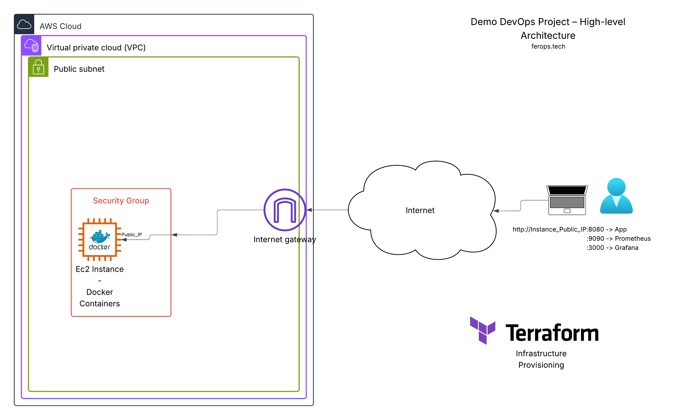
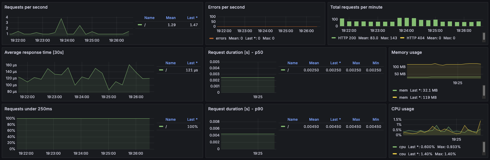

*High-level network diagram showing Docker containers on the EC2 instance, accessible via public IP and mapped ports.*

---

# Deployment Guide - Containerised Application  

## Docker Setup

### Pre-requisites

- [Docker](https://docs.docker.com/engine/install/)
- [Git](https://git-scm.com/downloads)

### a. Local App Containerisation
On your local machine, clone the repository and change directory:
```shell
git clone https://github.com/ferops-tech/devops-demo-projects.git
cd devops-demo-projects/demo-container-deploy/app
```

Build the app:
```shell
docker build -t flask-app .
docker image ls flask-app # to review the image has been built successfully
```


### b. Run the Container

Run the container locally to verify it works:

```shell
docker run -ti -p 8080:5000 flask-app
```

- The container should start, and you’ll see logs confirming it is running.
- Open your browser: [http://localhost:8080](http://localhost:8080)
- **Stop the container** with <kbd>Ctrl</kbd>+<kbd>C</kbd> when done.


### c. Pull from Remote Repository

This app image is publicly available on Docker Hub and can also be run without local build:
```shell
docker run -ti -p 8080:5000 feropstech/flask-app:latest
```

- The container will pull the image and start, just like the local build, and is reachable via the same above link.
- Stop the container with <kbd>Ctrl</kbd>+<kbd>C</kbd> when done.

---


## Terraform Setup

### Prerequisites

- An [IAM user credentials for the AWS CLI](https://docs.aws.amazon.com/cli/latest/userguide/cli-authentication-user.html), for an existing AWS account.


### a. SSH Key Pair Setup

If you already have an SSH key pair:
- **Public key** must be named `aws_keypair_test.pub` and stored in the repo at `./terraform/.ssh-terraform/`.
- **Private key** remains local (e.g., `~/.ssh/aws_keypair_test`) and is never shared.

>  If you don’t have a matching key, follow the steps below.

#### Generate a new SSH key pair
Generate a key and move the public part into the designated Terraform folder:
```shell
cd demo-container-deploy/terraform
ssh-keygen -t rsa -b 4096 -f ~/.ssh/aws_keypair_test
mv ~/.ssh/aws_keypair_test.pub .ssh-terraform/ 
chmod 400 ~/.ssh/aws_keypair_test
```

### b. Deploy Infrastructure
Initialize Terraform:
```shell
terraform init
```
Preview the infrastructure with the below command. It will show the execution plan, detailing what changes Terraform will make.
```shell
terraform plan
```

Deploy the infrastructure:
```shell
terraform apply
```
- Confirm the apply step.

Terraform will create:
- A custom VPC with public subnet
- Internet Gateway
- Route table and association
- Security group allowing SSH and HTTP
- EC2 instance with specified AMI and keypair

Example output (IDs and IPs will vary):
```shell
aws_vpc.my_vpc: Creating...
...
aws_instance.my_instance_test: Still creating... [00m10s elapsed]
aws_instance.my_instance_test: Creation complete after 13s [id=i-043d8e3b88b15d8ea]

Apply complete! Resources: 10 added, 0 changed, 0 destroyed.

Outputs:


app_url = "http://35.181.192.242:8080"
instance_private_ip = "10.0.0.10"
instance_public_ip = "35.181.192.242"
startup_note = "Wait a few minutes for the application to start and the web interface to become reachable."
```


### c. Access the EC2
SSH into the EC2 instance, replacing `YOUR_PRIVATE_KEY` and `YOUR_EC2_PUBLIC_IP` with your actual values:
```shell
ssh -o IdentitiesOnly=yes -i ~/.ssh/<YOUR_PRIVATE_KEY> ec2-user@<YOUR_EC2_PUBLIC_IP> # Your private key is "aws_keypair_test" if you followed along. The -o option avoids potential issues related to the SSH agent.
```

###### Expected output (your IP and fingerprints will differ):
```bash
The authenticity of host '<YOUR_EC2_PUBLIC_IP> (<YOUR_EC2_PUBLIC_IP>)' can't be established.
ED25519 key fingerprint is SHA256:DM3CNx9qhQOocdefF1l2BC/thtYTE8kdAf3xIxtV30g.
This key is not known by any other names.
Are you sure you want to continue connecting (yes/no/[fingerprint])? yes
Warning: Permanently added '<YOUR_EC2_PUBLIC_IP>' (ED25519) to the list of known hosts.
[ec2-user@ip-10-0-0-10 ~]$
```

**You are now connected to the EC2 instance. Logging in confirms that it is up and accessible.**

Logout from the instance when done with <kbd>Ctrl</kbd>+<kbd>D</kbd>.


### d. Useful Terraform Commands

After deploying the infrastructure, you can use the following commands to inspect or troubleshoot your resources:

```shell
# List all resources in the current Terraform state
terraform state list

# Show detailed information about all resources
terraform show

# Display the output values defined in Terraform
terraform output

# Refresh the state to reflect real-world changes
terraform refresh
```


### e. NOTE. Cleanup / Destroy Infrastructure
**Do not run these commands now.** 
This section explains how to permanently delete all the resources created in this guide. Continue to the next chapter if you want to keep the EC2 instance and proceed with the monitoring setup.
```shell
terraform destroy
```
- Terraform will show a preview of all resources that will be destroyed. 
- Confirm and wait for completion. 

Your EC2 instance, subnet, VPC and other resources will be permanently deleted.

---
## Monitoring Setup
### a. Connect to the EC2 instance
Use SSH to connect to the newly created instance, replacing `YOUR_PRIVATE_KEY` and `YOUR_EC2_PUBLIC_IP` with your actual values:
```shell
ssh -o IdentitiesOnly=yes -i ~/.ssh/<YOUR_PRIVATE_KEY> ec2-user@<YOUR_EC2_PUBLIC_IP> # Your private key is "aws_keypair_test" if you followed along. The -o option avoids potential issues related to the SSH agent.
```

### b. Review the Flask app
Ensure the flask-app container is running with `sudo docker ps`, else launch it with the below command (the `--network` option ensures the container runs in the same network as the monitoring applications):
```shell
sudo docker network create --driver bridge --label com.docker.compose.network=devops-playground devops-playground 2>/dev/null || true
sudo docker run -tid -p 8080:5000 --network devops-playground --name flask-app feropstech/flask-app:latest 2>/dev/null || true
```
The application is accessible from your local browser at:
- http://<YOUR_EC2_PUBLIC_IP>:8080

Send several requests (e.g.: refresh the page multiple times) to generate data that will be visible in the monitoring dashboards.

### c. Deploy the monitoring stack
**On the ec2 instance**, clone the repository and navigate to the monitoring directory:
```shell
cd devops-demo-projects/demo-container-deploy/monitoring
```

Start Prometheus and Grafana (images will be pulled from official repositories):
```shell
sudo docker compose up -d
```

###### Expected output:
```shell
[+] Running 22/22
 ✔ grafana Pulled 
   ✔ 9824c27679d3 Pull complete
   ✔ f28af41ca6c1 Pull complete
... 
   ✔ f671127533d7 Pull complete
 ✔ prometheus Pulled
   ✔ 9fa9226be034 Pull complete
   ✔ 1617e25568b2 Pull complete
...
   ✔ e9fa37e588a8 Pull complete
...
 ✔ Container grafana            Started        0.7s 
 ✔ Container prometheus         Started        0.7s 
```

Once started, Prometheus and Grafana should now be running and accessible:
- http://<YOUR_EC2_PUBLIC_IP>:9090/
- http://<YOUR_EC2_PUBLIC_IP>:3000/

### d. Verify Prometheus targets
Confirm that the `flask-app` target is listed as monitored:
- http://<EC2_PUBLIC_IP>:9090/targets


### e. Import the Grafana dashboard
1. Log in to Grafana using the credentials defined in docker-compose.yml (authentication information available in the docker-compose.yml file).

2. Go to **Dashboard > New > Import**.

3. Upload the `basic-dashboard.json` file from the monitoring directory.



Your Flask application is now monitored by Prometheus, and metrics can be visualized in Grafana.


### f. Destroy Infrastructure (Final Cleanup)

Once you have completed testing and monitoring, you can **permanently remove all resources**.

1. Log out from the EC2 instance:
```shell
logout
```

2. Execute Terraform commands locally:
```shell
cd terraform
terraform destroy
```
- Terraform will show a preview of all resources that will be destroyed.
- Confirm the action and wait for completion.

**Warning**: This will permanently delete your EC2 instance, VPC, subnet, Internet Gateway, security groups, and all associated resources.


> ⚠️ **Note:** Resources like EC2 and VPCs may incur charges on your AWS account. Always ensure cleanup is successful.


