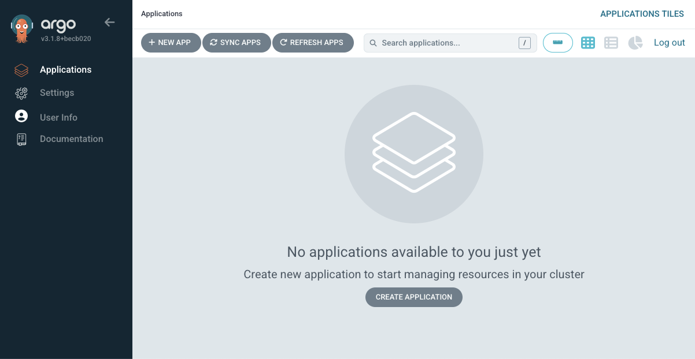

*High-level architecture diagram showing ...*

---

# Deployment Guide - Gitops Setup with ArgoCD

### Prerequisites
- [k3d](https://k3d.io/stable/)
- [Git](https://git-scm.com/downloads)
- [Helm](https://helm.sh/docs/intro/install/)
- [kubectl](https://kubernetes.io/docs/tasks/tools/)
- [AWS credentials](https://docs.aws.amazon.com/cli/latest/userguide/cli-chap-authentication.html)


## Kubernetes Setup (Local)

### a. K3d Startup

Launch a local multi-node cluster:
```shell
k3d cluster create demo-devops -p "8080:80@loadbalancer" --agents 2
```
⚠ Adjust port mapping if port 8080 is already in use.
### b. Application Deployment with Helm

Clone the repository and deploy the application using `helm`:
```shell
git clone https://github.com/ferops-tech/devops-demo-projects.git
cd devops-demo-projects/demo-kubernetes-orchestration/helm/flask-app/
helm install demo-devops . -n flask-ns -f ./values-local-k3d.yaml --create-namespace
```

Review the running pods, service and ingress:
```shell
kubectl get pod -n flask-ns -w
kubectl get services -n flask-ns
kubectl get ingress -n flask-ns
```


### c. Application Access
Open the appl in your browser: [http://127.0.0.1:8080](http://127.0.0.1:8080)


## Kubernetes Setup (AWS Cloud)
> ⚠️ **Note:** Resources created in this chapter may incur charges on your AWS account (~€0.10/hour for EC2 + networking).

### a. AWS Credentials Setup
Provide your AWS credentials as environment variables:
```shell
export AWS_ACCESS_KEY_ID=ABCD1234...
export AWS_SECRET_ACCESS_KEY=abcDE123...
```
Review access with:
```shell
aws sts get-caller-identity
```
###### Expected Output:
```shell
{
    "UserId": "YOURUSERIDWILLAPPEARHERE",
    "Account": "123456789012",
    "Arn": "arn:aws:iam::123456789012:user/my_user_name"
}
```

### b. Infrastructure Setup

Initialize and deploy cloud resources with Terraform:
```shell
cd ../../../demo-gitops-argocd/terraform/terraform-infra/   
terraform init    
terraform apply # Validate with 'yes'
```

###### Expected output after validating the deployment (IPs will vary)
```shell
aws_instance.my_instance_test: Creation complete after 13s [id=i-02d4efacceec96d49]

Apply complete! Resources: 10 added, 0 changed, 0 destroyed.

Outputs:

argocd_url = "http://15.237.60.102:30080"
instance_public_ip = "15.237.60.102"
logs_command = "ssh -i ~/.ssh/aws_keypair_test -o IdentitiesOnly=yes ec2-user@15.237.60.102 tail -f /var/log/cloud-init-output.log"
startup_note = "Wait a few minutes for the application to start and the web UI to be reachable. In the meantime, you can observe the logs with the above command."

```
> After a couple of minutes, the EC2 instance is deployed and ArgoCD was installed from the bootstrap script.

You can access the app in your browser.


### c. ArgoCD Access
Default user: `admin`.

Retrieve the password (replace `<INSTANCE-IP>` with your EC2 public IP):
```shell
ssh -i ~/.ssh/aws_keypair_test ec2-user@<INSTANCE-IP> \
  kubectl get secret -n argocd argocd-initial-admin-secret \
  -o jsonpath='{.data.password}' | base64 --decode; echo
```
Access the main ArgoCD page `http://<INSTANCE-IP>:30080`:


ArgoCD deployed via the bootstrap script on EC2 launch.
### d. Note: Infrastructure Cleanup
**Do not apply these command right now.**

The cloud infrastructure can be deleted with the below command:
```shell
terraform destroy # Validate with 'yes'
```


### d. Custom Application Setup

Export the ArgoCD password as environment variable (mind the variable name):
```shell
export TF_VAR_argocd_admin_password=$(ssh -i ~/.ssh/aws_keypair_test ec2-user@<INSTANCE-IP> \
  kubectl get secret -n argocd argocd-initial-admin-secret \
  -o jsonpath='{.data.password}' | base64 --decode)
```
⚠ Make sure the environment variable is named exactly **TF_VAR_argocd_admin_password**, as Terraform will reference this name when applying the ArgoCD application configuration.


Deploy the Flask app via Terraform:
```shell
cd ../terraform/terraform-app/
terraform init
terraform apply
```

###### Expected output (IP will vary):
```shell
argocd_application.flask_app: Creation complete after 2s [id=demo-devops-flask-app:argocd]

Apply complete! Resources: 1 added, 0 changed, 0 destroyed.

Outputs:

argocd_deploy_note = "You can now access the ArgoCD dashboard and view the deployed application using the credentials below:"
argocd_info = {
  "password" = "C8F1-xuc0gb-8DVs"
  "url" = "http://15.237.60.102:30080/applications"
  "user" = "admin"
}
flask_deploy_note = "You can now access the deployed application using the link below:"
flask_info = {
  "url" = "http:/15.237.60.102"
}

```
- **Visit** the ArgoCD UI with credentials to monitor the deployment..
- **Visit** the Flask app URL to see the running application.


### e. Continuous Integration Review
The **GitHub Actions workflow** builds and pushes the Docker image, then updates the manifests repository to trigger ArgoCD sync.
Review workflow:

```shell
cd ../../../.github/workflows/
cat github-actions.yaml
```

### f. Infrastructure Cleanup

**Important**: Deleting infrastructure will remove EC2, VPC, subnets, Internet Gateway, security groups, and all resources.
Destroy application first:

```shell
cd ../../demo-gitops-argocd/terraform/terraform-app      
terraform destroy
```

Then proceed with the infrastructure:
```shell
cd ../terraform-infra
terraform destroy
```


> ⚠️ **Note:** Resources like EC2 and VPCs may incur charges on your AWS account. Always ensure cleanup is successful.


