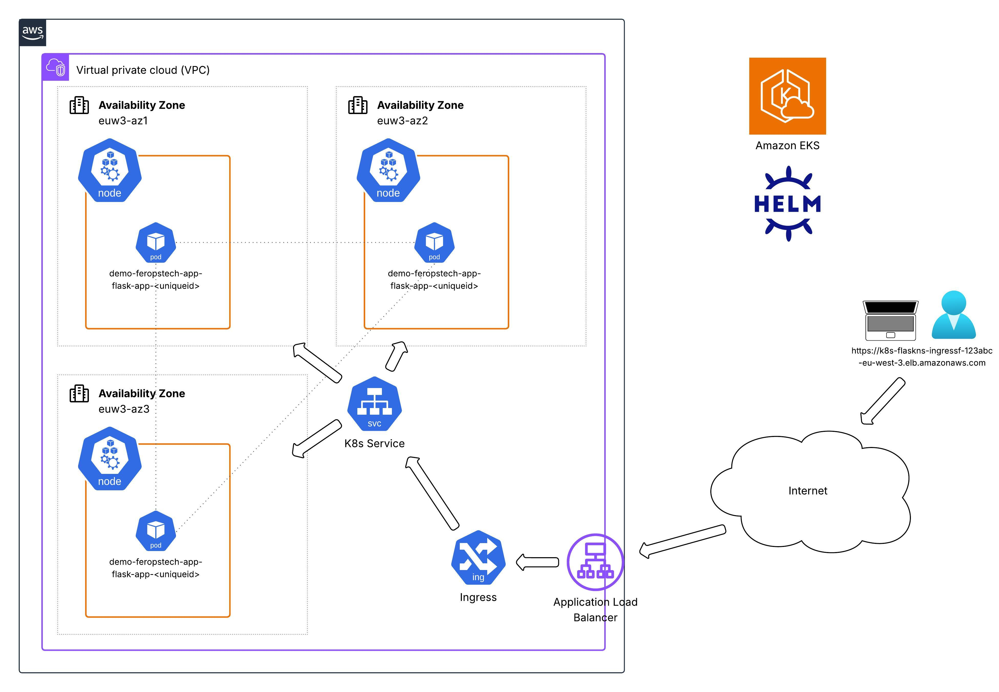
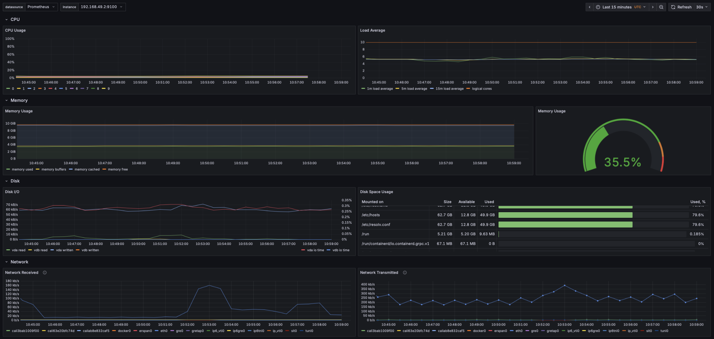

*High-level architecture diagram showing application pods running on Kubernetes nodes (EC2 instances), accessible through the external load balancer address.*

---

# Deployment Guide - Kubernetes Orchestration

### Prerequisites
- [Minikube](https://minikube.sigs.k8s.io/docs/start/)
- [Git](https://git-scm.com/downloads)
- [Helm](https://helm.sh/docs/intro/install/)
- [kubectl](https://kubernetes.io/docs/tasks/tools/)
- [AWS credentials](https://docs.aws.amazon.com/cli/latest/userguide/cli-chap-authentication.html)
- [eksctl](https://docs.aws.amazon.com/eks/latest/userguide/install-kubectl.html#eksctl-install-update)


## Kubernetes Local Setup

### a. Minikube Startup

Clone the repository and navigate to the project folder:
```shell
git clone https://github.com/ferops-tech/devops-demo-projects.git
cd devops-demo-projects/demo-kubernetes-orchestration
```

Launch Minikube with multiple nodes:
```shell
minikube start -c containerd --cni=calico --driver=vfkit
```

### b. Application Deployment with Helm (Local)

Deploy the application locally using the Helm chart with the local values file:
```shell
helm install flask-app -n flask-ns ./helm/flask-app  --create-namespace -f ./helm/flask-app/values-local.yaml
```

### c. Application Access
Follow the on-screen instructions and open the application in your browser. If the default browser does not render correctly, try another one:
```shell
export NODE_PORT=$(kubectl get --namespace flask-ns -o jsonpath="{.spec.ports[0].nodePort}" services flask-app)
export NODE_IP=$(kubectl get nodes --namespace flask-ns -o jsonpath="{.items[0].status.addresses[0].address}")
echo http://$NODE_IP:$NODE_PORT
```

### d. Useful Kubernetes Commands

After deploying the infrastructure, you can use the following commands to inspect or troubleshoot your resources:
```shell
# List the pods:
kubectl get pods

# List the services:
kubectl get services

# List details of a pod:
kubectl describe pod <POD-NAME>

# List the helm deployments:
helm list -A

# (Alternative driver) Launch a Minikube cluster with multiple nodes:
minikube start -c 'containerd' --cni="calico" --nodes=3 --driver=docker

# List the nodes:
kubectl get nodes -o wide

# Forward the service to localhost (required when using the Docker driver for Minikube):
minikube -n flask-ns service flask-app --url

```

### e. Minikube Deletion (Cleanup)
This command is used to completely delete the Minikube setup:
```shell
minikube delete
```
**Warning**: This will permanently delete the Minikube cluster and all associated resources.


---


## Amazon EKS Setup
> ⚠️ **Note:** Resources created in this chapter may incur charges on your AWS account.

### a. AWS CLI Access Verification

After configuring AWS CLI access, verify that your credentials are correctly set up:
```shell
aws sts get-caller-identity
```
Example output if you are connected to your account (IDs will vary):
```shell
{
    "UserId": "POIUYTREWQMDLKJHGFDSA",
    "Account": "123456789012",
    "Arn": "arn:aws:iam::123456789012:user/my_user_name"
}
```


### b. EKS Cluster Creation
Deploy the cluster using `eksctl`:
```shell
eksctl create cluster -f eks/cluster-setup/cluster-config.yaml
```
> This deployment may take several minutes to complete

Deploy the load balancer controller:
```shell
kubectl apply -f eks/cluster-setup/ingressclass.yaml
```
> Allow a few minutes for the EKS setup to complete


### c. Application Deployment with Helm (Local)

Deploy the application on the cloud:
```shell
helm install demo-feropstech-app --debug -n flask-ns ./helm-flask-app-eks/ --create-namespace
```

### d. Deployment Review

```shell
helm list -n flask-ns
kubectl get pods -n flask-ns
kubectl get ingress -n flask-ns
```
> The last command will show the URL that will be needed to access the application on Internet.

###### Expected output (Address will vary)
```shell
NAME                CLASS   HOSTS   ADDRESS                                                                    PORTS   AGE
ingress-flask-app   alb     *       k8s-flaskns-ingressf-6bf74956c2-1959894462.us-west-1.elb.amazonaws.com     80      31s
```
> Wait several minutes for the setup to complete and for the Application Load Balancer (ALB) to be provisioned.


### e. Cleanup Infrastructure Command
**In the next chapter**, we are going to cover the monitoring part. Once completed, the cluster can be cleaned up with the below command:

```shell
eksctl delete cluster -f cluster-setup/cluster-config.yaml
```
**Warning**: This will permanently delete the resources created above, including the EKS cluster and Application Load Balancer.
> ⚠️ **Note:** Resources created in this chapter may incur charges on your AWS account. Make sure the cleanup is completed successfully.
---

## Monitoring Stack Setup
### a. Kube-Prometheus Stack Deployment
Deploy the [kube-prometheus](https://artifacthub.io/packages/helm/prometheus-community/kube-prometheus-stack/77.12.0) stack using the official chart:
```shell
helm install monitoring oci://ghcr.io/prometheus-community/charts/kube-prometheus-stack -n monitoring --create-namespace
```

###### Expected output (some information may vary):
```shell
NAME: monitoring
LAST DEPLOYED: Thu Oct  2 13:00:46 2025
NAMESPACE: monitoring
STATUS: deployed
REVISION: 1
NOTES:
kube-prometheus-stack has been installed. Check its status by running:
  kubectl --namespace monitoring get pods -l "release=monitoring"

Get Grafana 'admin' user password by running:

  kubectl --namespace monitoring get secrets monitoring-grafana -o jsonpath="{.data.admin-password}" | base64 -d ; echo

Access Grafana local instance:

  export POD_NAME=$(kubectl --namespace monitoring get pod -l "app.kubernetes.io/name=grafana,app.kubernetes.io/instance=monitoring" -oname)
  kubectl --namespace monitoring port-forward $POD_NAME 3000

Visit https://github.com/prometheus-operator/kube-prometheus for instructions on how to create & configure Alertmanager and Prometheus instances using the Operator.
```

Follow the on-screen instructions (and above) and open your browser to access the Grafana UI::
```shell
export POD_NAME=$(kubectl --namespace monitoring get pod -l "app.kubernetes.io/name=grafana,app.kubernetes.io/instance=monitoring" -oname)
kubectl --namespace monitoring port-forward $POD_NAME 3000
```

### b. Grafana Access

Authenticate **>** Open the Dashboard section > Select the "Node Exporter / Node dashboard":


Your cluster nodes are now monitored and metrics can be visualized in Grafana.


