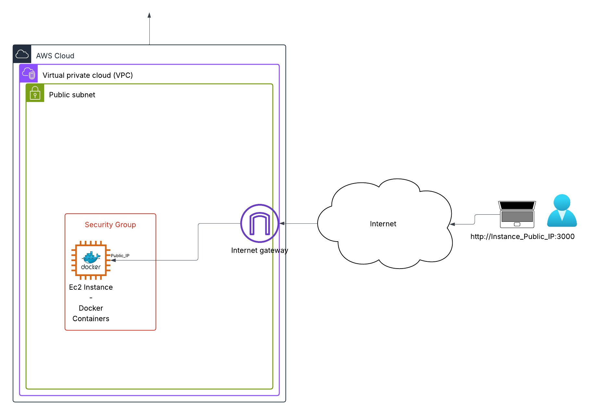

*High-level network diagram showing Docker containers on the EC2 instance, accessible via public IP and mapped ports.*

---

# Deployment Guide

## Docker Setup
### a. App Containerisation & Local Run
On your local machine, clone the repository and change directory:
```shell
git clone https://github.com/feropstech/devops-demo-projects.git
cd devops-demo-projects
```

Build the app:
```shell
docker build -f docker/Dockerfile -t flask-app .
```


### b. Run the Container

Run the container locally to verify it works:

```shell
docker run -ti -p 8080:5000 flask-app
```

- The container should start, and you’ll see logs confirming it’s running.
- Open your browser: [http://localhost:8080](http://localhost:8080)
- **Stop the container** with <kbd>Ctrl</kbd>+<kbd>C</kbd> when done.


### c. Pull from Remote Repository

This app image is publicly available on Docker Hub and can be run directly:
```shell
docker run -ti -p 8080:5000 feropstech/flask-app:latest
```

- The container will pull the image and start, just like the local build.

---


## Terraform Setup

### Prerequisites

- AWS credentials configured for an existing account (`aws configure`).


### a. SSH Key Pair Setup

If you already have an SSH key pair:
- **Public key** must be named `aws_keypair_test.pub` and stored in the repo at `./terraform/.ssh-terraform/`.
- **Private key** remains local (e.g., `~/.ssh/aws_keypair_test`) and is never shared.

>  If you don’t have a matching key, follow the steps below.

#### Generate a new SSH key pair
Generate a key and move the public part into the designated Terraform folder:
```shell
cd terraform
ssh-keygen -t rsa -b 4096 -f ~/.ssh/aws_keypair_test
mv ~/.ssh/aws_keypair_test.pub ./.ssh-terraform/ 
chmod 400 ~/.ssh/aws_keypair_test
```
Reference the public key in your Terraform configuration:
```shell
resource "aws_key_pair" "keypair_test" {
  public_key = file("~/.ssh-terraform/aws_keypair_test.pub")
}
```


### b. Deploy Infrastructure
Initialize Terraform:
```shell
cd terraform
terraform init
```
Preview the infrastructure:
```shell
terraform plan
```
Deploy the infrastructure:
```shell
terraform apply
```
- Confirm the apply step.

Terraform will create:

- A custom VPC with public subnet

- Internet Gateway

- Route table and association

- Security group allowing SSH and HTTP

- EC2 instance with specified AMI and keypair


### c. Access the EC2
1. SSH into the EC2 instance, replacing `YOUR_PRIVATE_KEY` and `YOUR_EC2_PUBLIC_IP` with your actual values:
```shell
ssh -i ~/.ssh/<YOUR_PRIVATE_KEY> ec2-user@<YOUR_EC2_PUBLIC_IP> # Replace <YOUR_EC2_PUBLIC_IP> with the actual public IP of your instance available in the output the terraform successful deployment
```

Logging in confirms that the EC2 instance is up and accessible.


### d. Useful Terraform Commands

After deploying the infrastructure, you can use the following commands to inspect or troubleshoot your resources:

```shell
# List all resources in the current Terraform state
terraform state list

# Show detailed information about all resources
terraform show

# Display the output values defined in Terraform
terraform output

# Refresh the state to reflect real-world changes
terraform refresh

# Destroy the infrastructure if needed
terraform destroy
```


### e. Cleanup / Destroy Infrastructure
If you want to remove all resources created by Terraform at the end of the setup:
```shell
cd terraform
terraform destroy
```
- Terraform will show a preview of all resources to be destroyed. 
- Confirm and wait for completion. 

Your EC2 instance, subnet, VPC and other resources will be deleted.

> ⚠️ **Note:** Resources like EC2 and VPCs may incur charges on your AWS account. Always ensure cleanup is successful.


---
## Monitoring Setup
### a. Connect to the EC2 instance
Use SSH to connect to the newly created instance, replacing `YOUR_PRIVATE_KEY` and `YOUR_EC2_PUBLIC_IP` with your actual values:
```shell
ssh -i ~/.ssh/<YOUR_RIVATE_KEY> ec2-user@<YOUR_EC2_PUBLIC_IP> # the public IP is available in the output of the terraform successful deployment
```

### b. Review the Flask app
Ensure the flask-app container is running with `docker ps`, else launch it (the `--network` option ensures the container runs in the same network as the monitoring applications):
```shell
docker run -tid -p 8080:5000 --network devops-playground --name flask-app feropstech/flask-app:latest
```
The application is accessible at:
- http://<EC2_PUBLIC_IP>:8080

Send several requests (e.g.: refresh the page) to generate data that will be visible in the monitoring dashboards.

### c. Deploy the monitoring stack
Clone the repository and navigate to the monitoring directory:
```shell
git clone https://github.com/ferops-tech/devops-demo-projects.git
cd devops-demo-projects/monitoring
```

Start Prometheus and Grafana:
```shell
sudo docker compose up -d
```

Once started, the services are accessible at:
- http://<EC2_PUBLIC_IP>:9090/
- http://<EC2_PUBLIC_IP>:3000/

### d. Verify Prometheus targets
Confirm that the `flask-app` target is listed as monitored:
- http://<EC2_PUBLIC_IP>:9090/targets


### e. Import the Grafana dashboard
1. Log in to Grafana using the credentials defined in docker-compose.yml (authentication information available in the docker-compose.yml file).

2. Go to **Dashboard > New > Import**.

3. Upload the `basic-dashboard.json` file from the monitoring directory.


Your Flask application is now monitored by Prometheus, and metrics can be visualized in Grafana.
