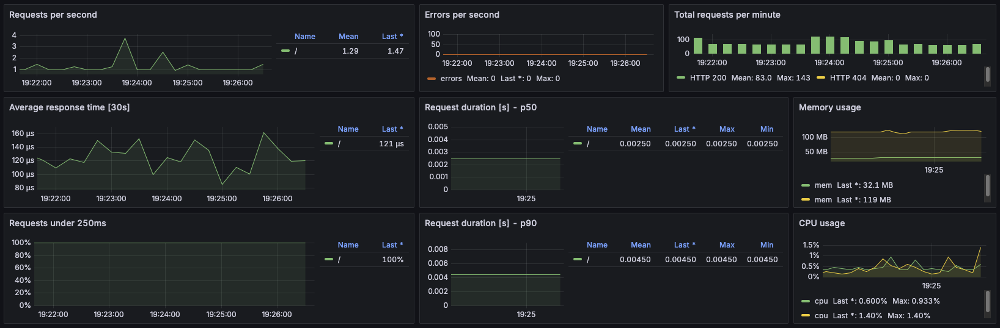

# Deployment Guide

## Docker Setup
### a. App Containerisation & Local Run
On your local machine, clone the repository and change directory:
```shell
git clone https://github.com/feropstech/devops-demo-projects.git
cd devops-demo-projects
```

Build the app:
```shell
docker build -f docker/Dockerfile -t flask-app .
```


### b. Run the Container

Run the container locally to verify it works:

```shell
docker run -ti -p 8080:5000 flask-app
```

- The container should start, and you’ll see an interactive prompt or logs confirming it’s running.
- Open your browser: [http://localhost:8080](http://localhost:8080)
- **Stop the container** by pressing <kbd>Ctrl</kbd>+<kbd>C</kbd> when done.


### c. Pull from Remote Repository

This app image is publicly available on Docker Hub and can be run directly using the command below:
```shell
docker run -ti -p 8080:5000 feropstech/flask-app:latest
```

- The container should pull the image and start, just like the local build.
---


## Terraform Setup

### Prerequisites

- AWS credentials configured for an existing account (aws configure).


### a. SSH Key Pair Setup

#### - Existing SSH Key Pair
If you already have an SSH key pair, make sure it is prepared for Terraform:
- **Public key** must be named `aws_keypair_test.pub` and stored in the repo at `./terraform/.ssh-terraform/`
- **Private key** must be named `aws_keypair_test` and remain local (e.g., `~/.ssh/aws_keypair_test`) and is never shared.

>  If you don’t have an existing SSH key pair with this exact name, follow the steps in **Key Pair Setup** below before applying Terraform.

#### -  Key Pair Setup (if needed)

a. Generate a new SSH key pair and move the public key into the designated `terraform` folder so that Terraform can see it:
```shell
cd terraform
ssh-keygen -t rsa -b 4096 -f ~/.ssh/aws_keypair_test
chmod 400 ~/.ssh/aws_keypair_test
mv ~/.ssh/aws_keypair_test.pub ./.ssh-terraform/ 
```
b. Reference the public key in your Terraform configuration:
```shell
resource "aws_key_pair" "keypair_test" {
  public_key = file("~/.ssh-terraform/aws_keypair_test.pub")
}
```


### b. Deploy Infrastructure
Change directory to the Terraform folder:
```shell
cd terraform
```
Initialize Terraform:
```shell
terraform init
```
Preview the infrastructure to be created:
```shell
terraform plan
```
Deploy the infrastructure:
```shell
terraform apply
```
- Confirm the apply step.

Terraform will create:

- A custom VPC with public subnet

- Internet Gateway

- Route table and association

- Security group allowing SSH

- EC2 instance with specified AMI and keypair


### c. Access the EC2
1. SSH into the EC2 instance and confirm it is reachable
```shell
ssh -i ~/.ssh/<YOUR_PRIVATE_KEY> ec2-user@<EC2_PUBLIC_IP> # Replace <EC2_PUBLIC_IP> with the actual public IP of your instance available in the output of the successful execution of the terraform deployment
```

Logging in confirms that the EC2 instance is up and accessible. You can now proceed with next chapter.


### d. Useful Terraform Commands

After deploying the infrastructure, you can use the following commands to inspect or troubleshoot your resources:

```shell
# List all resources in the current Terraform state
terraform state list

# Show detailed information about all resources
terraform show

# Display the output values defined in Terraform
terraform output

# Refresh the state to reflect real-world changes
terraform refresh

# Destroy the infrastructure if needed
terraform destroy
```


### e. Cleanup / Destroy Infrastructure
If you want to remove all resources created by Terraform at the end of the setup:
```shell
cd terraform
terraform destroy
```
- Terraform will show a preview of all resources to be destroyed. 
- Confirm to proceed and wait for completion. 
- After this, your EC2 instance, subnet, VPC and other resources will be deleted.

> ⚠️ **Note:** The resources created (EC2, VPC, etc.) may incur charges on your AWS account. 
>    Make sure resources got deleted properly.


---
---


## Monitoring Setup

Connect to the newly created EC2 instance:
```shell
ssh -i ~/.ssh/<YOUR_PRIVATE_KEY> ec2-user@<EC2_PUBLIC_IP> # Replace <EC2_PUBLIC_IP> with the actual public IP of your instance available in the output of the successful execution of the terraform deployment
```

Ensure the flask-app is properly running with the below command `docker ps`, else launch it (you'll notice the `network` option to launch the container in the same network than the monitoring apps):
```shell
docker run -tid -p 8080:5000 --network devops-playground --name flask-app feropstech/flask-app:latest
```
It is reachable on the port 8080 (execute multiple request to make relevant data appear in a later step):
- http://<EC2_PUBLIC_IP>:8080

Clone the repository and change directory:
```shell
git clone https://github.com/feropstech/devops-demo-projects.git
cd devops-demo-projects/monitoring
```

Change directory to the `monitoring` one and create the monitoring containers (Prometheus & Grafana):
```shell
cd monitoring
docker compose up -d
```

The two applications are reachable via:
- http://<EC2_PUBLIC_IP>:9090/
- http://<EC2_PUBLIC_IP>:3000/

Ensure the flask-app is listed in the monitored targets:
- http://<EC2_PUBLIC_IP>:9090/targets

You can then proceed into Grafana (authentication information available in the docker-compose.yml file in the monitoring folder) to add a dashboard and import the following:
- \> Dashboard > New > Import 

- Import the `basic-dashboard.json` file in the monitoring repo

